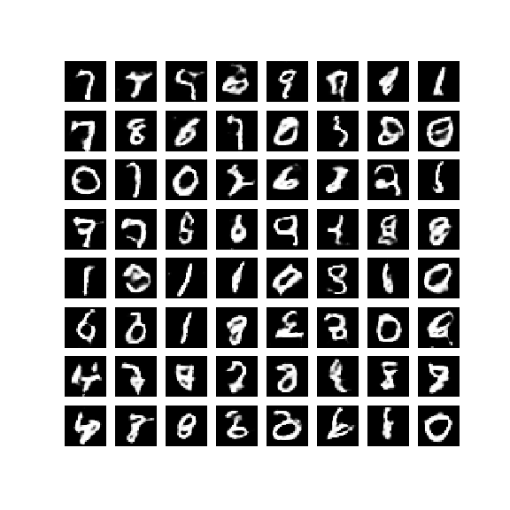
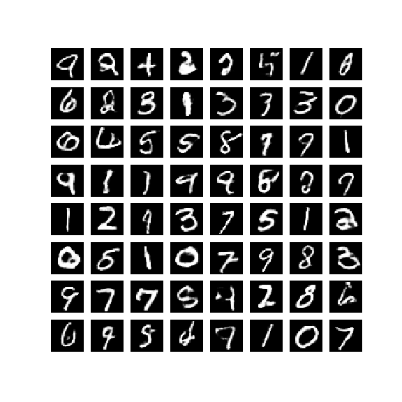
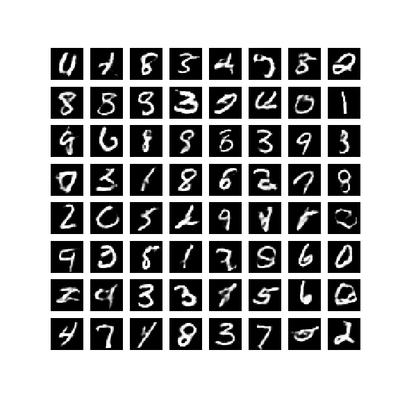
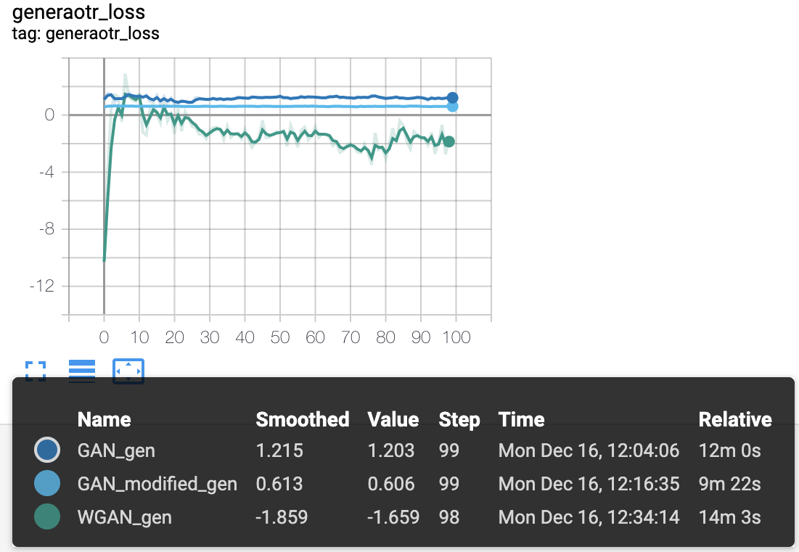
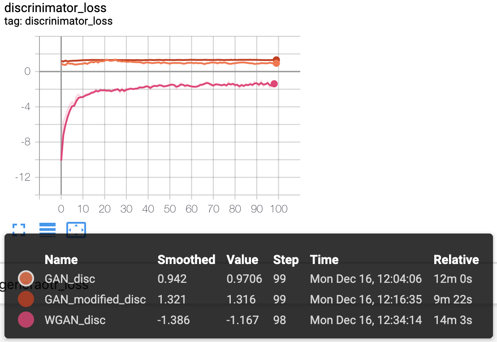
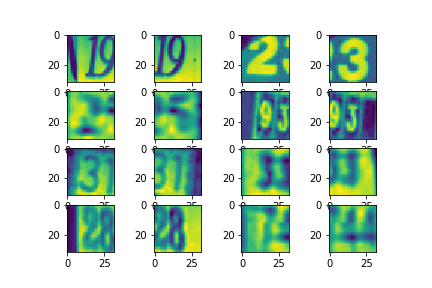
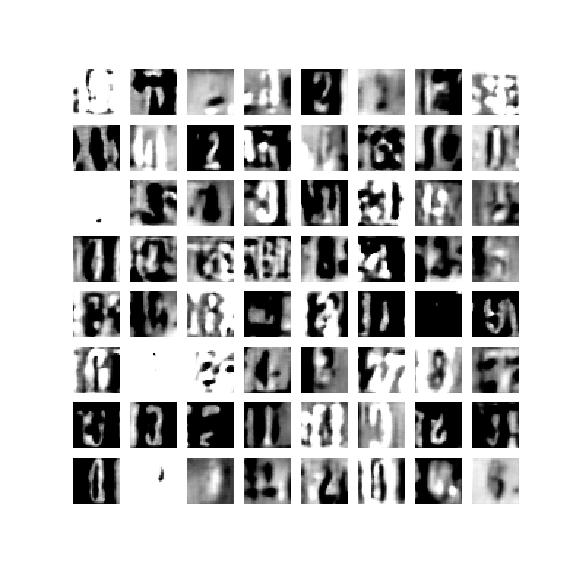

# STAT5242 GAN Project

In this project, we explored the topic of Generative Adversarial Networks and built several models implementations using the Keras library.   

GANs are a form of neural network in which two sub-networks are trained on opposing loss functions: an generator that is trained to produce data which resemble the true data, and a discriminator that is trained to discriminate between the fake data and generated data. Our goal for this poriject is to train the GAN models to reproduce pictures. We used two datasets: MNIST and SVHN.
 
              
For MNIST, we ran a simple GAN with CNN layers as a baseline model and modified the architecture and hyper-parameters to generate a more advanced model. For SVHN, we applied the advanced model from MNIST first to see if there's any differenes in the quality compared to the GAN on MNIST. We also explored different architecture of neural networks and hyperpa-rameters. As an improved method, WGAN was implemented and compared with the traditional GAN method. 

- The dataset can be downloaded at
	- MNIST dataset: http://yann.lecun.com/exdb/mnist/
	- SVHN dataset(Format 2): http://ufldl.stanford.edu/housenumbers/

## Models

GAN_WGAN_MNIST.ipynb: GAN and WGAN models on MNIST dataset

GAN_WGAN_SVHN.ipynb: GAN and WGAN models on SVHN dataset

## Results

The resulting pictures, gifs and plots of loss can be found in the output folder.

- MNIST

|Original|Baseline|Advanced|WGAN|
|:-:|:-:|:-:|:-:|
|||||

|Generator loss|Discriminator loss|
|:-:|:-:|
||

- SVHN

|Originial|Baseline|Advanced|WGAN|
|:-:|:-:|:-:|:-:|
|||||

|Generator loss|Discriminator loss|
|:-:|:-:|
||

## Reference
[1] Goodfellow, Ian, et al. "Generative adversarial nets." Advances in neural information processing systems. 2014. http://papers.nips.cc/paper/5423-generative-adversarial-nets.pdf          
[2] Deep Convolutional Generative Adversarial Network. https://www.tensorflow.org/tutorials/generative/dcgan          
[3] Hui Jonathan. “GAN — Wasserstein GAN & WGAN-GP” https://medium.com/@jonathan_hui/gan-wasserstein-gan-wgan-gp-6a1a2aa1b490            
[4] Wenyi Yu. “When we talk about  Deep Learning：GAN and WGAN”
https://zhuanlan.zhihu.com/p/29394257              
[5] Tim Sainburg. “Generative models in Tensorflow 2” https://github.com/timsainb/tensorflow2-generative-models
